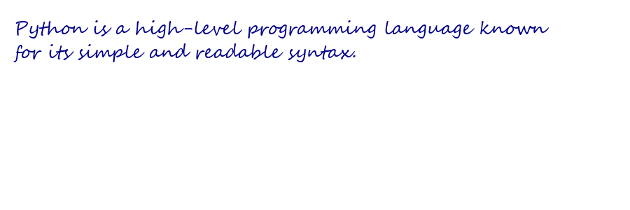

# Handwriting Generator using Python

This project converts digital text into realistic handwritten style images using Python.

## Features

* Generates handwriting from any text input
* Custom font support
* Works offline
* Adjustable text size and color

## Technologies Used

* Python
* Pillow (Image Processing)

## How it works

The program creates a blank image and writes the given text using a TrueType handwriting font. The output is saved as an image file.

## Future Improvements

* Multiple handwriting styles
* GUI application
* AI-based handwriting generation

## Output

## Author

Yashaswi Rai M 
